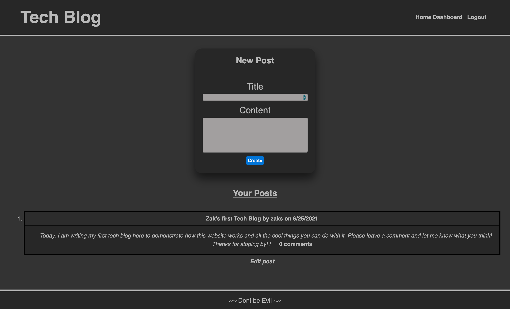

# Blog This 

## Links

  Repo Link: https://github.com/theoneandonlyzako/Blog-This
   
  Direct Link: https://blog-this-tech-blog.herokuapp.com/
    
  

  # Description
This is an Express.js, Sequelized and MySQL based application with account login capabilities to create your own post on anything tech, user can also comment on other posts. 
  

  # Table of Contents 
  * [Installation](#installation)
  * [Usage](#usage)
  * [License](#license)
  * [Contributing](#contributing)
  * [Steps](#steps)
  * [Contact](#contact)
  
 
  # Installation
  The following must be installed or linked in order to run the application properly: "bcrypt", "dotenv", "express", "express-handlebars", "express-session", "mysql2", "sequelize".
  
  # Usage
  ​Users can Read, create, update and delete posts on anything tech and comment on other posts created by other users.
 
  # License
  This project is licensed under the Unlicense license.
  
  # Contributing
  ​Contributors: Zak Stamps With Lots of help from our trusty 'ol friend Google.

  # Steps
  **Installation**  
Download and clone the repository to your machine; 
npm install  
CREATE DATABASE blog_this_db 
USE blog_this_db 
Run "npm start" to begin the appication  

**After you run this app:** 
open <i>http://localhost:3001/</i> in your browser

    
  
  # Contact
  If you have any questions about the repo, open an issue or contact me directly at theoneandonlyzako@gmail.com or visit my website at zakstamps.com
      

  <!-- ### Demo Video Link: https://youtu.be/J1E1TSqqFPw -->
 
    

  
 
